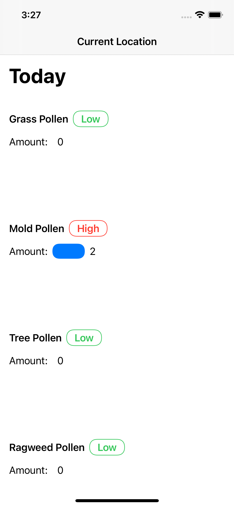
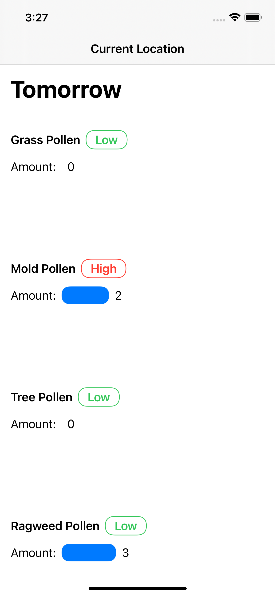

# Pollen 

Simple iOS/macOS pollen tracking app written in SwiftUI. It uses the AccuWeather API for pollen forecasts. This project was worked on mainly during March and April of 2020.

This project has not yet been completed, and has been shelved for now. It served as a great way to learn SwiftUI architectures by making a more complicated project.

